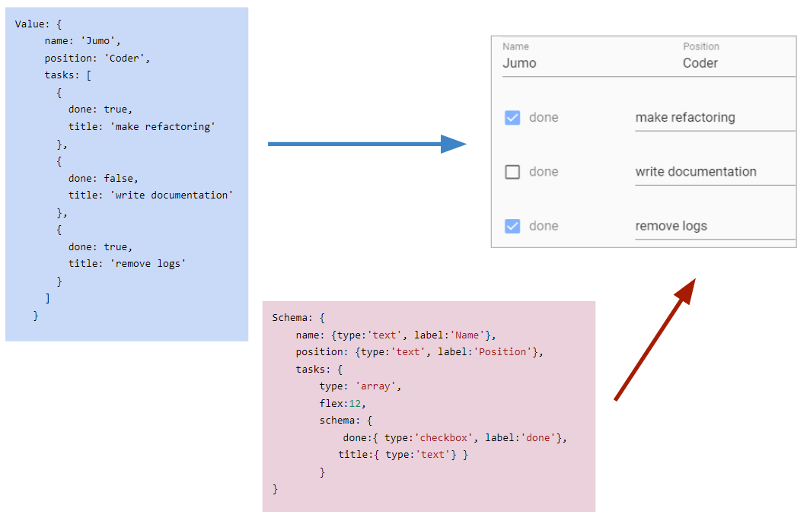
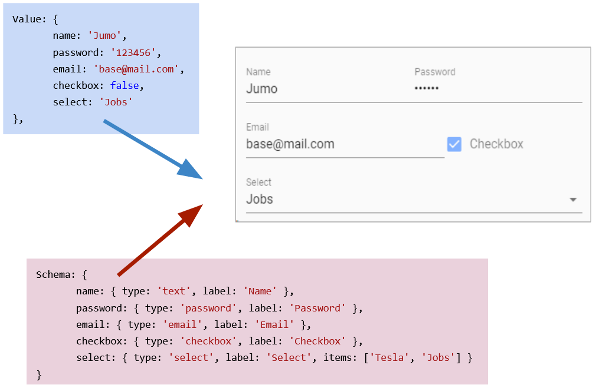
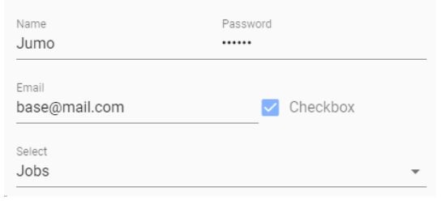
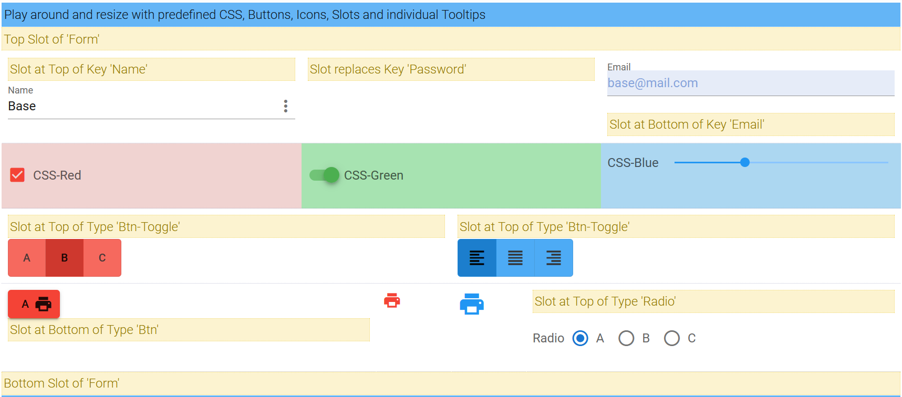
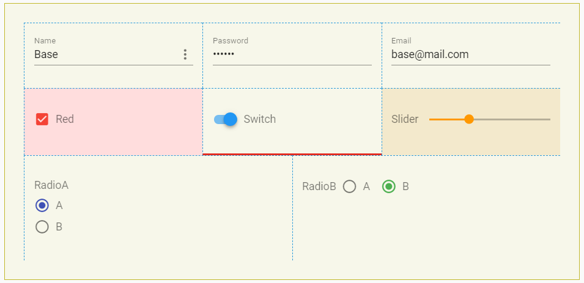

# Vuetify-Form-Base

Imagine you get the following data as JS-Object and your Task is to design a Form to edit this data 

    Value: {
      name: 'Jumo',
      position: 'Coder',
      tasks: [
        { 
          done: true,
          title: 'make refactoring' 
        },
        { 
          done: false,
          title: 'write documentation'  
        },
        { 
          done: true,
          title: 'remove logs'  
        }        
      ]        
    }

Normally you have to flatten the Data-Structure and map all to an appropriate Format. Then you have to define a HTML-Form and animate it with your Data. 

With **Vuetify-Form-Base** create a Schema Object with the same structure as your Data.

	Schema: {
		name: {
			type:'text', 
			label:'Name', 
			flex:6 
		},
		position: {
			type:'text', 
			label:'Position', 
			flex:6 
		},
		tasks: { 
			type: 'array',
			schema: { 
				done:{ type:'checkbox', label:'done', flex:3}, 
				title:{ type:'text', flex:9 }
			} 
		}
	}  

and you will get a full reactive and editable Form:

If you have to generate forms or you have to edit Data presented as JSON- or JS-Objects, then take a closer look at **Vuetify-Form-Base** and try it. It can make your work much easier and save you time. This Form Generator works as [Vue.js 2.0 Component](https://vuejs.org/) and can simplify your Job by automatically creating Forms, based on your Schema-Definition. Edit your created Forms and you will automatically receive reactive Results.

**Vuetify-Form-Base** uses the well known and excellent [Component Framework Vuetify](https://vuetifyjs.com/) to style and layout your Form. Vuetify Controls have a clear, minimalistic design and support responsive Design.

---
## Demo

[Look for an Example on Github](https://wotamann.github.io/)

or

Download Project, change current directory to **../vuetify-form-base/example**  and then run

`npm install`

`npm run serve`

---
## Intro

**vuetify-form-base** is a [Vue Component](https://vuejs.org/v2/guide/components.html) and can easily integrated into any Vue Project.   

The Schema-Object has the **same structure** as the Value-Object. Create a Schema by cloning the Value-Object and replace the Values of the Data-Object by Definitions for your your Schema. The corresponding Schema-Object defines type, layout and functional behaviour of the Controls in your Form. 

The [Component Framework Vuetify](https://vuetifyjs.com/) styles your Form. The Controls have a clear design, but don't worry if you need more you can change your style in a lot of ways. For more details see section **Style with CSS**

Based on an existing Value-Object **vuetify-form-base** generates a full editable Form. 
Layout and Functionality are defined in a Schema-Object, which has the same Property structure as the Value-Object. Your Data-Object keeps full reactive and any Input or Change in your Form triggers an Event too. If you have a deep nested Value-Object or an Array-Structure you can direct work on it. There is no need to flatten or modify your Data Presentation.

Changing any Field in the Form gives you a **reactive Result** in your Value-Object. 
Furthermore you can **synchronize** two or more Forms by using same Value-Object. 

If you want a **Partial-Form** which displays only parts of your Data.Object, then link a property of your Data-Object to your **vuetify-form-base** Component. 

And if necessary you can also build a **Form in Form** by using **Slots**.

Use the **v-on directive** of Vue.js to listen to Formbase **triggered Events** for 'Resize', 'Focus', 'Input', 'Blur', 'Click', 'Mouse' and 'Swipe'. Listening to 'Change' will catch all Value changing Events like 'Input' and 'Click'. 'Watch' will listen to 'Focus', 'Input', 'Blur' and 'Click'. Listening to 'Update' will catch all Events. 

### Supported Controls from **Vuetify UI Input & Controls**  
----

#### Textfield - Text: 
	schema: { ctrl: 'text', ... }
	schema: { ctrl: { type:'text', ...}, ... }
#### Textfield - Password: 
	schema: { ctrl: 'password', ... }
	schema: { ctrl: { type:'password', ...}, ... }
#### Textfield - Email:  
	schema: { ctrl: 'email', ... }
	schema: { ctrl: { type:'email', ...}, ... }
#### Textfield - Number:  
	schema: { ctrl: 'number', ... }
	schema: { ctrl: { type:'number', ...}, ... }

[More Informations to Vuetify Textfields find here](https://vuetifyjs.com/en/components/text-fields/). 

#### File-Input: 
	schema: { ctrl: 'file', ... }
	schema: { ctrl: { type:'file', ...}, ... }

[More Informations to Vuetify File-Input find here](https://vuetifyjs.com/en/components/file-inputs/). 

#### Textarea:
	schema: { ctrl: 'textarea', ... }
	schema: { ctrl: { type:'textarea', ...}, ... }

[More Informations to Vuetify Textarea find here](https://vuetifyjs.com/en/components/textarea/). 

#### Select:
	schema: { ctrl: 'select', ... }
	schema: { ctrl: { type:'select', ...}, ... }

[More Informations to Vuetify Select find here](https://vuetifyjs.com/en/components/select/). 

#### Combobox:
	schema: { ctrl: 'combobox', ... }
	schema: { ctrl: { type:'combobox', ...}, ... }

[More Informations to Vuetify Combobox find here](https://vuetifyjs.com/en/components/combobox/). 

#### Autocomplete:
	schema: { ctrl: 'autocomplete', ... }
	schema: { ctrl: { type:'autocomplete', ...}, ... }

[More Informations to Vuetify Autocomplete find here](https://vuetifyjs.com/en/components/autocomplete/). 

#### Checkbox: 
	schema: { ctrl: 'checkbox', ... }
	schema: { ctrl: { type:'checkbox', ...}, ... }

#### Radio: 
	schema: { ctrl: { type:'radio', ...}, ... }

#### Switch: 
	schema: { ctrl: 'switch', ... }
	schema: { ctrl: { type:'switch', ...}, ... }

[More Informations to Vuetify Selection-Controls find here](https://vuetifyjs.com/en/components/selection-controls/). 

#### Slider: 
	schema: { ctrl: 'slider', ... }
	schema: { ctrl: { type:'slider', ...}, ... }

[More Informations to Vuetify Sliders find here](https://vuetifyjs.com/en/components/sliders/). 

#### Icon: 
	schema: { ctrl: 'icon', ... }
	schema: { ctrl: { type:'icon', ...}, ... }

[More Informations to Vuetify Icons find here](https://vuetifyjs.com/en/components/icons/). 

#### Button: 
	schema: { ctrl: 'btn', ... }
	schema: { ctrl: { type:'btn', ...}, ... }

[More Informations to Vuetify Buttons find here](https://vuetifyjs.com/en/components/buttons/). 

#### Button Group: 
	schema: { ctrl: 'btn-toggle', ... }
	schema: { ctrl: { type:'btn-toggle', ...}, ... }

[More Informations to Vuetify Button Groups find here](https://vuetifyjs.com/en/components/button-groups/). 

#### Treeview: 
	schema: { ctrl: 'treeview', ... }
	schema: { ctrl: { type:'treeview', ...}, ... }

[More Informations to Vuetify Treeview find here](https://vuetifyjs.com/en/components/treeview/). 

#### Array: 
	schema: { ctrl: { 
		type:'array', 
		schema: { 
			ctrl: 'text' 
			},
			... 
		}, 
		... 
	}
---

#### List: 
	schema: { ctrl: 'list', ... }
	schema: { ctrl: { type:'list', ...}, ... }

[More Informations to Vuetify List-Item-Groups find here](https://vuetifyjs.com/en/components/list-item-groups/). 

#### Colorpicker: 
	schema: { ctrl: 'color', ... }
	schema: { ctrl: { type:'color', ...}, ... }

[More Informations to Vuetify Color-Pickers find here](https://vuetifyjs.com/en/components/color-pickers/). 

#### Datepicker: 
	schema: { ctrl: 'date', ... }
	schema: { ctrl: { type:'date', ...}, ... }
	date-pickers
[More Informations to Vuetify Date-Pickers find here](https://vuetifyjs.com/en/components/date-pickers/). 
	
#### Timepicker: 
	schema: { ctrl: 'time', ... }
	schema: { ctrl: { type:'time', ...}, ... }

[More Informations to Vuetify Time-Pickers find here](https://vuetifyjs.com/en/components/time-pickers/). 
	

---
## Installation

For proper working you need a Vue.js Project with Vuetify 2.0 installed. For more Details see [Vuetify 2.0 Quickstart](https://dev.vuetifyjs.com/en-US/getting-started/quick-start).  
After a successful installation of a VUE project with Vuetify 2.0  

    npm install vuetify-form-base --save

**vuetify-form-base** is a [Vue.js single-file component](https://vuejs.org/v2/guide/single-file-components.html) with a .vue extension and you can use it like any Vue-Component. 

In order for your application to work properly, you must wrap it in a [v-app](https://next.vuetifyjs.com/en-US/framework/default-markup) component. This component is required and can exist anywhere inside the body, but must be the parent of ALL Vuetify components. **v-content** needs to be a direct descendant of **v-app**. 

    <template>
      <v-app>
        <v-content>
          <v-container fluid>
            <v-form>
              <v-form-base :value="myValue" :schema="mySchema" />
            </v-form>
          </v-container>   
        </v-content>
      </v-app>
    </template>

	import VFormBase from 'vuetify-form-base';  

    export default {	
      components:{ VFormBase },
      data () {
        return {
          myValue: {
            name: 'Jumo',
            password: '123456',
            email: 'base@mail.com',
            checkbox: true,
            select: 'Jobs',
          },   
          mySchema: {
            name: { type: 'text', label: 'Name' },
            password: { type: 'password', label: 'Password' },
            email: { type: 'email', label: 'Email' },
            checkbox: { type: 'checkbox', label: 'Checkbox' },
            select: { type: 'select', label: 'Select', items: ['Tesla', 'Jobs', 'Taleb'] }
          }
        }
      }
    }

and you will get a full editable Form based on your schema and filled with your Value-Object. 

>INFORMATION: 
>
>Properties in 'myValue' without corresponding Prop in 'mySchema', are ignored and keep untouched, but a initial warning will be logged to console

---
## Example displaying nested Data-Object
 

In Reality sometimes you will have deep nested objects or arrays, which should be edited. **vuetify-form-base** works for you and flatten internally this nested object and build a plain Form.   

      myValue: {
        name: 'Base',
        controls:{
          selection:{
            select: 'Tesla',
            selectM: ['Jobs'],
          },
          switch: [ true,false ],
          checkbox: [ false, true, { 
            checkboxArray: [ true, false ]}
          ]
        }       
      },

      mySchema: {
        name: { type: 'text', label: 'Name'},
        controls:{
          selection:{
            select: { type: 'select', label: 'Select', items: ['Tesla', 'Jobs', 'Taleb'] },        
            selectM: { type: 'select', label: 'M-Select', multiple:true, items: ['Tesla', 'Jobs', 'Taleb']}
          },
          switch: [ 
            { type: 'switch', label: '1' }, 
            { type: 'switch', label: '2' } 
          ],
          checkbox: [
            { type: 'checkbox', label: 'A' },
            { type: 'checkbox', label: 'B' }, 
            { checkboxArray: [
              { type: 'checkbox', label: 'C-A', color:'red' },
              { type: 'checkbox', label: 'C-B', color:'red' }
            ]}  
          ],
        }
      }

---
## Example editing Data-Arrays
 
For editing arrays use the type 'array' and define an nested 'schema' property. 

    mySchema: {
      tasks: {
        type: 'array',
        schema: { 
          done: { type: 'checkbox'  }, 
          title: { type: 'text' }
        }
      }  
    }

#### Type Array - Schema object

    myValue: {      
      tasks: [
        {
          done: true,
          title: 'make refactoring'
        },
        {
          done: true,
          title: 'write documentation'
        },
        {
          done: true,
          title: 'remove logs'
        }
      ]
    },
    mySchema: {
      tasks: {
        type: 'array',
        schema: { 
          done: { type: 'checkbox', label: 'Ok', flex: 3 }, 
          title: { type: 'text', flex: 8 },            
        }
      }
    }

---
## Computed Schema
 
IF you want Schema Properties to be changed dynamic, then you must make your Schema Object a computed property. This Example turns the Radio Layout from Column to Row on Resizing to medium Size or greater. 

    data () {
      return {
    
        myValue: {
          radio: 'A',
        }
    
      }   
    },
    computed: {          
    
      mySchema(){ 
        return {
          radio: { type: 'radio', row: this.row, options:['A','B'] }
        }
      },
    
      row () {
        return this.$vuetify.breakpoint.mdAndUp 
      }
    },

## Vuetify Layout and Grid

Integrate Vuetify Grid by using the Schema-Properties 'flex', 'offset' and 'order':

    mySchema: {
      name: { type: 'text', flex: 4, offset: 2, order: 1 },
    }

    flex: 4     // shorthand for flex: { xs:4 }
    offset: 2   // shorthand for offset: { xs:2 }
    order: 1    // shorthand for order: { xs:1 }
    
A more responsive Solution with 'flex', 'offset' or 'order' needs an Object as Value. For more Details see Vuetify Documentation:  

[Vuetify - Grid:](https://vuetifyjs.com/en/framework/grid#usage) 
flex: { xs:12, sm:8, md:6, lg:4 }

[Vuetify - Offset:](https://vuetifyjs.com/en/framework/grid#offset) 
offset: { xs:0, sm:1, md:2, lg:2 }

[Vuetify - Order:](https://vuetifyjs.com/en/framework/grid#order) 
order: { xs:1, sm:1, md:2, lg:2 }

## Link & Synchronize

Forms can be **linked** together using the same Value-Object. Changes in one Form are synchronized and reflected in the other Form. 

	<v-form-base :value="myValue" :schema="mySchema" />

	<v-form-base id="form-sync" :value="myValue" :schema="mySchema" />

 
## Vuetify Controls API-Props

[Vuetify Controls have a API with Props](https://vuetifyjs.com/en/components/text-fields#api) These Props in Vuetify-Controls comes in **kebab-case** amd must for use in Schema-Object converted to **CamelCase**

    <!-- vuetifyjs.com -->
    Input & Controls
      Text-fields
        API-Props   
          append-icon
          background-color 

    <!-- JS -->
    mySchema: { 
      name: { type:'text', appendIcon:'menu', backgroundColor': 'red' },
      ...
    }

## Schema

	<form-base :schema="schema" ... />

Schema is an JS-Object, which defines and controls the behavior of your Form. Each Key Prop) in your Schema-Object must reflect a Key from your Data-Object. A minimalistic Definition of a text input could look like this:

    schema:{
      name: { type:'text'}  
    }

The next shows a more complex Schema:
  
    // Partials Functions for Rules
    const minLen = l => v => (v && v.length >= l) || `min. ${l} Characters`
    const maxLen = l => v => (v && v.length <= l) || `max. ${l} Characters`
    const required = msg => v => !!v || msg
    const validEmail: msg => v => /.+@.+\..+/.test(v) || msg
  
	// Destruct Value and return a Value! 
    const toUpper = ( {value} ) => value && value.toUpperCase() 
    
    export default {
    
      components: { VFormBase },
      data () {
        return {
          
          myValue: {
            name: 'Base',
            password: '123456',
            email: 'base@mail.com'
          },
                  
          mySchema: {
            name: { 
              type: 'text', 
              label: 'Name', 
              hint:'Converts to UpperCase'
              toCtrl: toUpper, 
              fromCtrl:toUpper,
              rules: [ required('Name is required<>) ] 
              flex: 12, 
            },
            password: { 
              type: 'password', 
              label: 'Password', 
              hint:'Between 6-12 Chars', 
              appendIcon: 'visibility', 
              counter: 12, 
              rules: [ minLen(6), maxLen(12) ], 
              clearable: true, 
              flex: 12 
            },
            email: { 
              type: 'email', 
              label: 'Email', 
              rules: [ validEmail('No valid Email'), required('Email is required<>) ], 
              flex: 12 
            }
          }
        }
      }
    }

**Available Properties in Schema ( NEW: PICKERS and FILE-INPUT available )**
  
[For further Props see Vuetify Controls API](https://vuetifyjs.com/en/components/text-fields#api)  

	schema:{
      
      type: string            // text, password, email, file, 
                              // radio, switch, slider,
                              // combobox, autocomplete, select,  
                              // date, time, color    

      sort: N                 // use simple order to display items 

      order: N or Object      // use Vuetify-Grid to order items responsive 
      flex: N or Object       // See Vuetify Grid
      offset: N or Object     // See Vuetify Grid

      label string,           // label of item    
      placeholder: string,    // placeholder 
      hint: string,           // additional Info  
      tooltip: string | bool  // show tooltip - use Slots for individual text

      color: string
      backgroundColor:string
      css: string,            // inject classnames - schema:{ name:{ css:'small'}, ...  }
        
      mask: string,           // regex to control input  

      multiple: bool,         // used by type: select, combobox, autocomplete    
      required: bool,         // need an input value
      hidden: bool,           // hide item - set from another item
      disabled: bool,         
      readonly: bool,          
            
      appendIcon: icon        // click triggers event with icon-location
      prependIcon: icon       // click triggers event with icon-location

      items: array            // ['A','B'] used by type: select, combobox, autocomplete   
      options: array,         // ['A','B'] used by type:radio
      rules: array of Fn      // [ value => true || false, ... ]
      
      // must return a (modified) value!!
      toCtrl: function,       // ( {value, obj, data, schema} ) => value	
      fromCtrl: function,     // ( {value, obj, data, schema} ) => value
    }

## Events

We can use the v-on directive to listen to vuetify-form-base events **'focus', 'input', 'blur', 'click', 'mouse', 'resize', 'swipe', 'update'** and run some Code when they’re triggered.
    
This Example use the Default ID and listen all events with 'update':

    <!-- HTML -->
    <v-form-base :value= "myValue" :schema= "mySchema" @update= "update" />
    
The next Code has the Custom ID **'form-base-simple'**. In this case your v-on Directive must append the Custom ID like **@update:form-base-simple:**

    <!-- HTML -->
    <v-form-base 
      id = "form-base-simple" 
      :value= "myValue" 
      :schema= "mySchema" 
      @update:form-base-simple= "update" 
    />

You can also listen to an specific event. Your v-on Directive must append the Custom ID:

    <!-- HTML -->
    <v-form-base :value= "myValue" :schema= "mySchema" @blur= "blurCode" />
   
    <v-form-base 
      id = "form-base-complete"
      :value= "myValue" 
      :schema= "mySchema"  
      @click:form-base-complete= "clickCode"
      @input:form-base-complete= "inputCode"
      @change:form-base-complete= "changeCode"
      @watch:form-base-complete= "watchCode"
      @focus:form-base-complete= "focusCode"
      @blur:form-base-complete= "blurCode"
      @mouse:form-base-complete= "mouseCode"
      @swipe:form-base-complete= "swipeCode"
      @resize:form-base-complete= "resizeCode"
      @update:form-base-complete= "updateCode"     
    />

  Listen to one or more of following events
        
        @input= "change"
        @click= "change"
        @change="change" // input & click
        @watch= "change" // focus & input & click &  blur
        @focus= "change"
        @blur=  "change"
        @mouse= "change" // mouseenter & mouseleave
        @resize="change"
        @swipe= "change"
        @update="change" // catch all events

**The Event-Signature:**

    change( {  on, id, key, value, params, obj, data, schema, parent, index, event } ){
      // destructure the signature object 
    }

    on -        Trigger Name  // focus|input|blur|click|resize|swipe|update 
    id -        Formbase-ID
    key -       key of triggering Element
    value -     value of triggering Element
    obj -       triggering Element { key, value, schema } 
    event -     the native trigger-event if available 
    params -    params object if available { text, x, y, tag, model, open, index }    
    index -     index of array of schemas  
    data -      Data-Object
    schema -    Schema-Object
    parent -    Formbase-Object - if available 
---
**Example: Use 'Update' Event to control Visibility of Password Element**

    <!-- HTML -->
    <v-form-base :value="myValue" :schema="mySchema" @update="update">

    <!-- JS -->
    // Schema
    mySchema: {
      password:{ type:'password', appendIcon:'visibility', .... }
    }
    
    ...
    
    update ({ on, key, obj, params }) {
      // test event is 'click' and comes from appendIcon on key 'password'
      if (on == 'click' && key == 'password' && (params && params.tag) == 'append') {         
        // toggle icon
        obj.schema.appendIcon = obj.schema.type === 'password' 
          ? 'lock' 
          : 'visibility'

        // toggle visibility 
        obj.schema.type = obj.schema.type === 'password' 
          ? 'text' 
          : 'password'
      }
    }
---
## Slots

Use Slots to pass Header and Footer into a Control. If necessary replace Controls by Slots. Any slot could be a v-form-base component itself.   
 
    <v-form-base :value="myValue" :schema="mySchema" @update="update">

      <h4 slot="slot-top-key-name">Top Slot on Key Name</h4>
      <h4 slot="slot-top-type-radio">Top Slot on Types Radio</h4>
      
      <h4 slot="slot-item-key-password">Slot replaces Key Password</h4>
      
      <h4 slot="slot-bottom-key-name">Bottom Slot Key Name</h4>
      <h4 slot="slot-bottom-type-radio">Bottom Slot on Types Radio</h4>
      
      // Tooltip see css.vue in Example 
      

        {{ slotProps.obj.schema.tooltip }} has value '{{ slotProps.obj.value }}
      

    
    </v-form-base>

---
## [Form Validation](https://wotamann.github.io/)

If you need Form Validation you have to wrap **v-form-base** with **[v-form](https://next.vuetifyjs.com/en/components/forms#api)** and take the reference of v-form for working on.
    
    <!-- HTML -->    
    <v-form ref="form" v-model= "formValid" lazy-validation>
      <v-form-base :value= "myValue" :schema= "mySchema" @update= "update"/>
    </v-form>

    <!-- JS -->
    validate () {
      this.$refs.form.validate()
    },

    resetValidation () {
      this.$refs.form.resetValidation()
    },

---

## Style with CSS 

Customize your **vuetify-form-base** component using CSS-Classnames 
 
>  IMPORTANT:  
>  Don't use `

---
## Features

* Vue-Component
* integrates UI framework Vuetify with responsive Layout and Support of Grid
* Use a lot of Vuetify Control & Input types inclusive most of available API-Props
* Get full configurable Forms based on Schema Definition
* Edit plain or deep nested objects including Arrays, without the need to flatten your data
* Get a full, reactive Result
* Listen on 'Resize', 'Focus', 'Input', 'Blur', 'Click', 'Swipe' and 'Update' Events
* Use Slots to pass Header and Footer into a Control or replace a Control by a Slot.  Use  Slots to individualize your Tooltip   
* Configurable CSS Style 

---
#### Version 0.1.9
- added support for v-icon | { type:'icon'}   

#### Version 0.1.8
- Revision of example, 
- bug fixed with tooltip in array   

#### Version 0.1.8
- tooltip added

#### Version 0.1.6
- tooltip added

#### Version 0.1.5
- Event 'blur' available  

#### Version 0.1.4

- File Input added (type:'file')
- Pickers for Color, Date and Time added/adapted (type:'color|date|time')   

#### Version 0.1.3

- control type 'list' and 'array' added

---
## Dependencies

vue >= 2.6

vuetify >= 2.0

lodash > 4.15

vue-the-mask

---
## Similar Projects

[vue-form-generator](https://github.com/icebob/vue-form-generator)

[vue-formular](https://github.com/matfish2/vue-formular)

---
## License

**vuetify-form-base** is available under the MIT license.
